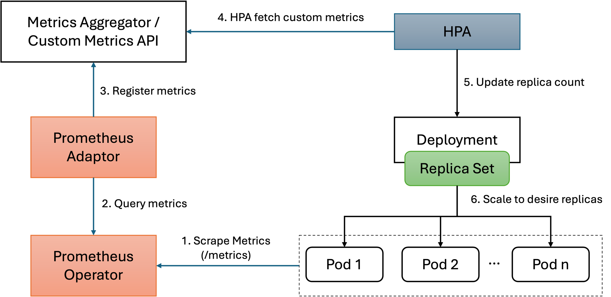
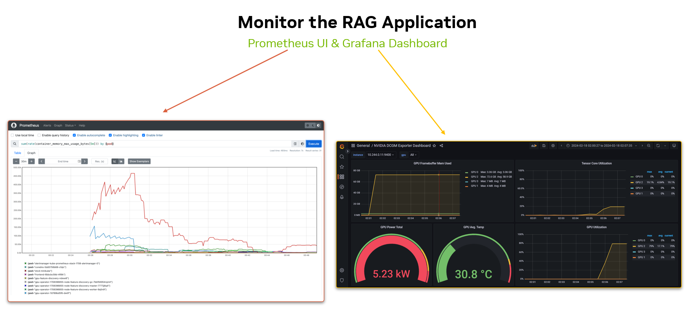
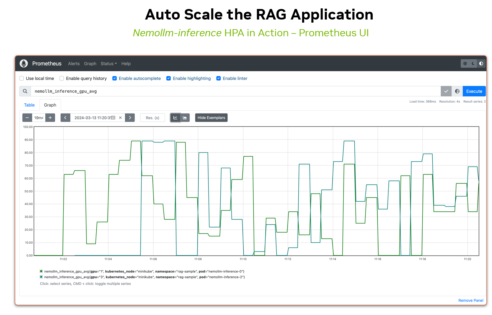

# Table of Contents

- [Table of Contents](#table-of-contents)
  - [Introduction](#introduction)
  - [Setting Up the Environment](#setting-up-the-environment)
  - [NVIDIA AI Foundation end points](#nvidia-ai-foundation-end-points)
  - [Deploying NVIDIA Retriever Embedding microservice locally](#deploying-nvidia-retriever-embedding-microservice-locally)
  - [Deploying NVIDIA Retriever microservice locally](#deploying-nvidia-retriever-microservice-locally)
  - [Deploy a Huggingface model with NIM](#deploy-a-huggingface-model-with-nim)
  - [Train a LoRA and deploy with NIM](#train-a-lora-and-deploy-with-nim)
  - [Performance analysis](#performance-analysis)
      - [Time to First Token Calculation:](#time-to-first-token-calculation)
      - [Inter-token latency](#inter-token-latency)
      - [Load testing](#load-testing)
  - [Deployment at scale](#deployment-at-scale)
      - [Deployment of NIMs on kubernetes cluster](#deployment-of-nims-on-kubernetes-cluster)
      - [Monitoring the RAG application](#monitoring-the-rag-application)
      - [Autoscaling (Horizontal Pod Autoscaling)](#autoscaling-horizontal-pod-autoscaling)

## Introduction

The following set of playbooks will introduce NIM and different NVIDIA microservices.

## Setting Up the Environment

```
conda create -n nim_env python=3.10 pip
pip install -r requirements.txt
```

Before diving into the playbooks, it's essential to ensure your environment is properly configured. Most users will have a basic implementation from one of the open-source LLM (Large Language Model) orchestration frameworks like Langchain, Haystack, etc.

In this folder, you'll find an example implementation that utilizes Langchain, OpenAI embeddings, and OpenAI LLM. Specifically, we have implemented a basic Retriever, Answerer, and Generator (RAG) model using Langchain. This RAG model leverages OpenAI embeddings and the OpenAI LLM for its functionality. Additionally, we utilize a web scraper to gather data and use it as a corpus for our RAG model. ChromaDB serves as the vector database in this setup.

To get started, navigate to:

```
{root folder of git codebase}/Step0/RAG_OpenAI.ipynb
```

This Jupyter notebook provides a hands-on guide to setting up and understanding the RAG model within the described environment. Follow along with the instructions provided to ensure a smooth setup process.

## NVIDIA AI Foundation end points

As a first step, we will use NVIDIA AI foundation endpoints hosted at this location: [Foundation models](https://ai.nvidia.com).
The API reference to use these models with Langchain wrappers can be found here: [API Reference](https://python.langchain.com/docs/integrations/chat/nvidia_ai_endpoints/). The notebook

```
{root folder of git codebase}/Step1/RAG_NVEndpoints.ipynb
```

contains the necessary code changes from the baseline to use NVIDIA Foundational models.

## Deploying NVIDIA Retriever Embedding microservice locally

Now that we've familiarized ourselves with the basic setup and functionalities, it's time to take the next step and deploy the NREM (NVIDIA Retriever Embedding Microservice) locally.

The purpose of this deployment is to replace the NVIDIA AI Foundation endpoints used in the previous step, which relied on a hosted endpoint. By deploying the embedding model locally, we gain more control and flexibility over its usage and integration within our environment.

```
{root folder of git codebase}/Step2/NREM.ipynb
```

## Deploying NVIDIA Retriever microservice locally

Building upon our previous deployment of the Embedding Microservice, we are now ready to deploy the retriever. Unlike the previous deployment, the retriever orchestrates multiple containers, including the embedding model, re-ranker, and an accelerated vector database. To streamline this process, we will utilize Docker Compose, allowing us to bring up this complex service with simple commands.

```
{root folder of git codebase}/Step3/Retriever.ipynb
```

## Deploy a Huggingface model with NIM

TODO


Hugging Face has become a central hub for LLMs, offering a vast array of pre-trained models as well as fine-tuned for various tasks. In this notebook, we'll explore how developers can integrate Hugging Face models into the NIM.

## Train a LoRA and deploy with NIM


TODO


This notebook shows how one can use NeMo Framework to train LoRA adapaters and subsequently deploy it for inference using NIMs.


## Performance analysis

TODO

Compute the performance metrics and load testing.

#### Time to First Token Calculation:

- Measure the time from when a request is received by the service until the first token is processed.

#### Inter-token latency

- Measure the time between processing consecutive tokens in a sequence.

#### Load testing

- Use a load testing tool to simulate multiple simultaneous requests to the service.
- Execute the load tests and monitor various performance metrics such as response time, throughput, error rate, and system resource utilization.


## Deployment at scale

TODO


#### Deployment of NIMs on kubernetes cluster



#### Monitoring the RAG application



#### Autoscaling (Horizontal Pod Autoscaling)


